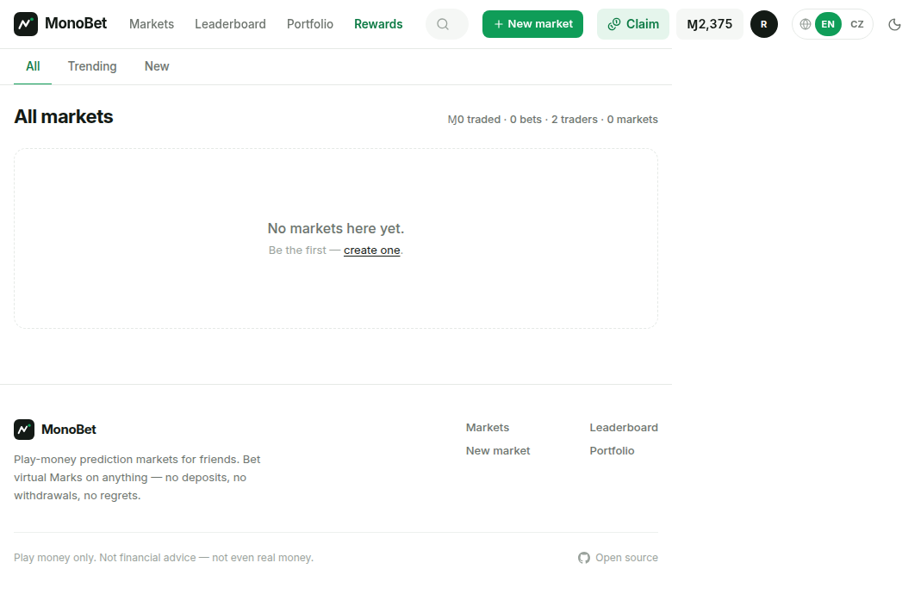
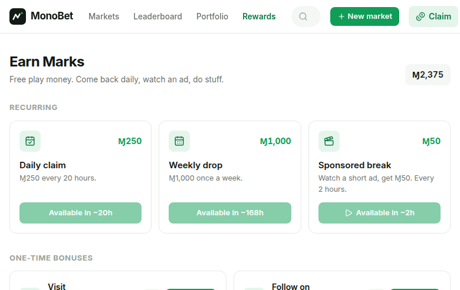
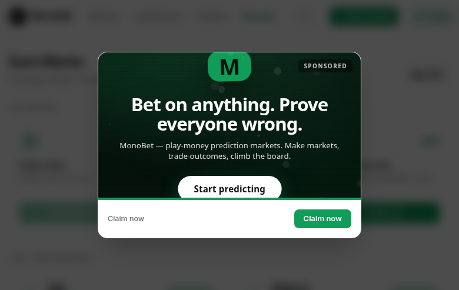

<p align="center">
  
</p>

<h1 align="center">MonoBet</h1>

<p align="center">
  Play-money prediction markets in the style of Polymarket.<br>
  Bet virtual Marks (Ɱ) on custom events with friends — no real payments, ever.
</p>

<p align="center">
  <a href="#quick-start">Quick Start</a> ·
  <a href="https://monobet.tdvorak.dev">Live app</a> ·
  <a href="https://github.com/Dvorinka/monobet/releases">Releases</a> ·
  <a href="CONTRIBUTING.md">Contributing</a>
</p>

<p align="center">
  <a href="https://github.com/Dvorinka/monobet/blob/main/LICENSE"></a>
  <a href="https://github.com/Dvorinka/monobet"></a>
  <a href="https://monobet.tdvorak.dev"></a>
</p>

## What is MonoBet?

MonoBet is a Polymarket-style prediction market that runs entirely on virtual
currency. Anyone can open a market — yes/no or multi-outcome — pick the
starting odds, and watch an LMSR automated market maker reprice it as friends
trade. Winnings pay out in Marks, which buy nothing and are worth nothing. It
exists for fun, bragging rights, and settling arguments.

**It is not a real prediction market, betting service, or financial product.**

## Screenshots

| Markets | Rewards | Sponsored break |
|:-:|:-:|:-:|
|  |  |  |

## Features

- **Binary & multi-outcome markets** priced by LMSR — instant liquidity, prices move with every trade; "X by when?" groups render each option as its own Yes/No line, resolved options collapse under "View resolved"
- **Leveraged trading** — buy at up to 100× (per-market ceiling, default 10×): collateral covers the margin, the loan lives on the position, sells/resolves repay it first, and positions auto-liquidate when their value can't cover the debt
- **Minigames arcade** (`/games`) — coin flip, dice roll-over, blind stop-the-timer (server-timestamped rounds), limbo multiplier, a spinner wheel, slots, and blackjack with side bets; all take variable bets at up to 100× margin leverage — wins pay amplified profit, losses cap at the stake plus a small funding fee, never debt
- **Anyone can create a market** — it goes live instantly; the creator picks per-option starting odds (1–99%) and liquidity depth (Thin/Standard/Deep)
- **Creator & admin management** — edit rules/images/dates without breaking live markets (question locks once bets exist), resolve YES/NO, cancel with refunds
- **User-managed categories** — starts empty; anyone can mint one inline in the market form, admins rename (markets carry over) and delete empty ones
- **English / Čeština** — full UI i18n, header toggle, locale-aware dates and numbers
- **Rewards page** — daily faucet, weekly drop, sponsored-ad claim with generated fake ad creatives, and one-time bonuses (links + first trade/market/comment milestones)
- **Comments 2.0** — image attachments (client-side compressed), like/dislike votes, newest/top sorting
- **Custom profile pictures** — avatars everywhere: comments, leaderboard, header
- **Live charts** — animated probability chart with crosshair tooltip, multi-line option charts, sparklines on every card, live bets ticker
- **Dark & light themes** — system-aware, persisted, no flash on load
- **Portfolio & leaderboard** — positions, trade history, auditable cash-flow ledger, net-worth ranking
- **Admin panel** — resolve/cancel/delete any market, create users, grant balances, manage categories; user management with password resets, comment mutes, full bans (sessions dropped + sign-in blocked), and role toggles; `SUPER_ADMIN_EMAIL` pins the owner account
- **Terms of Use** — `/terms` states plainly: fun-only demo, virtual Marks, no real market; linked in the footer and on signup

## Architecture

```
Browser ──▶ Vercel (Next.js 16 App Router, server actions)
                 ├──▶ Neon Postgres (Drizzle ORM, row-locked transactions)
                 └──▶ Better Auth (username + password sessions)
```

- Balances are integer cents; shares are `numeric(24,6)`; every balance change writes a `ledger` row — cash flow is fully auditable.
- Trades run in a single Postgres transaction with `SELECT … FOR UPDATE` on market + user — no overspending, no partial trades.
- LMSR liquidity parameter `b` controls price impact; starting odds seed `q_yes = b·ln(p/(1−p))` so markets open at any probability.
- "Live" feel is polling (`router.refresh()` every 8–15 s, paused when hidden) — no websocket server needed on serverless.

## Quick Start

Prerequisites: Node 20+, a Neon (or any Postgres) database.

```bash
git clone https://github.com/Dvorinka/monobet.git && cd monobet
cp .env.example .env.local   # fill in DATABASE_URL*, BETTER_AUTH_SECRET
npm install
npx drizzle-kit migrate      # apply schema (uses DATABASE_URL_UNPOOLED)
npm run dev
```

## Configuration

| Var | Purpose |
|---|---|
| `DATABASE_URL` | Neon **pooled** connection (app queries) |
| `DATABASE_URL_UNPOOLED` | Neon **direct** connection (migrations only) |
| `BETTER_AUTH_SECRET` | Session signing secret |
| `BETTER_AUTH_URL` | App base URL (e.g. `https://monobet.tdvorak.dev`) |
| `SUPER_ADMIN_EMAIL` | Always-admin account email (default: `info@tdvorak.dev`) |

## Deploy

Live at **https://monobet.tdvorak.dev** — Neon Postgres + Vercel.
`vercel.json` pins the `nextjs` framework preset so the Vercel builder emits
serverless functions. Set the env vars above in the Vercel project, then
`vercel --prod`.

## Legal

MonoBet is a personal demo project made for fun. Marks (Ɱ) are virtual play
money with no monetary value — they cannot be bought, sold, deposited, or
withdrawn. Nothing here is a real prediction market, betting service, or
financial product.

## Contributing

See [CONTRIBUTING.md](CONTRIBUTING.md) for the development workflow.

## Security

See [SECURITY.md](SECURITY.md) for reporting vulnerabilities.

## License

[MIT](LICENSE)
